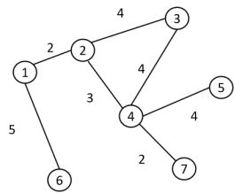

# 图卷积神经网络 (GCN) 

CNN 每个pixel都有固定邻居 ，图卷积处理不规则的拓扑结构（如分子结构、复杂背景下多个实体的关系）。 

GCN由Node和Edge组成，每次操作让Node了解它邻居的特征，然后更新自己的状态。 
**第一步聚合**：收集所有与当前节点相连的邻居节点特征。 
**第二步更新**：邻居特征和自身特征结合，通过权重矩阵和非线性激活函数，生成当前节点新特征。 

## 1. 核心数学表达

经典前向传播公式：

$$H^{(l+1)} = \sigma(\tilde{D}^{-\frac{1}{2}}\tilde{A}\tilde{D}^{-\frac{1}{2}}H^{(l)}W^{(l)})$$

**公式参数**： 
* $H^{(l)}$：第 $l$ 层的节点特征矩阵。 
* $\tilde{A}$：加入了自环的邻接矩阵（$\tilde{A} = A + I$），确保节点更新时保留自身历史信息。 
* $\tilde{D}$：$\tilde{A}$ 的度矩阵，配合进行对称归一化，防止特征值爆炸。 
* $W^{(l)}$：当前层的可学习权重矩阵。 
* $\sigma$：非线性激活函数。

#### 第一步：特征映射变换（$H^{(l)}W^{(l)}$）
*   传统的线性变换。我们将当前第 $l$ 层所有节点的特征矩阵 $H^{(l)}$ 乘上一个可学习的权重矩阵 $W^{(l)}$。 
*   这一步和传统的全连接层没有任何区别。 

#### 第二步：聚合邻居信息（$\tilde{A} \times (H^{(l)}W^{(l)})$）
*   带有自环的邻接矩阵 $\tilde{A}$ 与刚刚映射好的特征矩阵相乘。 
*   矩阵乘法中，$\tilde{A}$ 的每一行指示当前节点该去“收集”哪些邻居的特征。因为 $\tilde{A} = A + I$（加了单位阵），所以它不仅把所有相连邻居的特征加了起来，还顺带把自己刚刚提炼好的特征也加了进去。它相当于一个**动态形状的卷积核**，完全根据拓扑关系来决定感受野，突破了经典 CNN 中固定网格的物理限制。 

#### 第三步：双向对称归一化（$\tilde{D}^{-\frac{1}{2}} \times \dots \times \tilde{D}^{-\frac{1}{2}}$）
*   在聚合好的矩阵左边和右边，分别乘以度矩阵 $\tilde{D}$ 的负平方根。 
*   如果只做第二步，那些拥有几百个连接的“超级节点”，其特征值相加后会变得无比巨大，导致梯度爆炸。因此需要双向乘积来抑制： 
    *   **左乘 $\tilde{D}^{-\frac{1}{2}}$：** 降低那些“自身邻居特别多的接收者”的累加值权重。 
    *   **右乘 $\tilde{D}^{-\frac{1}{2}}$：** 降低那些“自身邻居特别多的发送者”传出来的特征权重。 

#### 第四步：非线性激活（$\sigma$）
*   将经过归一化的线性结果传入激活函数。 
*   这一步赋予了模型拟合复杂非线性边界的能力。模型设计中，降低硬件推理延迟并避免神经元死亡问题。 

## 2. 优势
GCN 打破了固定卷积核感受野的物理限制，显式的建模实体之间的依赖关系，直接在特征空间中建立跨越物理距离的长程语义关联。 

## 3.两大流派
### (1) **Spectral(频域) GCN**:无法直接做规则卷积。 

$$ \text{空间域} \xrightarrow{\text{图傅里叶变换}} \text{频域} $$

在频域相乘后，

$$ \text{频域} \xrightarrow{\text{图傅里叶逆变换}} \text{空间域} $$

> **数学前置知识： [拉普拉斯矩阵详解](/laplacian.md)**

### (2) 空间域图卷积 (Spatial GCN) 与 GraphSAGE 

#### Spatial GCN：主动去“采样”和“强行聚合”，把不规则的邻居变成统一的形状。

#### GraphSAGE ：采样 (Sample) 与 聚合 (Aggregate)
GraphSAGE（Graph Sample and Aggregate）是空间域 GCN 的巅峰之作，彻底解决了图网络无法处理超大规模数据的痛点。

*   **第一步：邻居采样 (Neighbor Sampling)**
    *   **痛点**：超级节点（Hub）可能有上万个邻居。如果更新一次特征要把所有邻居都算一遍，显存瞬间就会爆炸（“邻居爆炸”问题）。
    *   **GraphSAGE 的做法**：设定一个固定的采样数量 $S$。比如，强制规定每个节点在第一跳（1-hop）只随机采样 5 个邻居，在第二跳（2-hop）只随机采样 10 个邻居。
    *   **效果**：类似“下采样 / Dropout”。

*   **第二步：特征聚合 (Feature Aggregation)**
    *   三种聚合函数（相当于 Pooling）：
        1.  **Mean Aggregator（均值聚合）**：把邻居的特征向量加起来求平均，类似于 Average Pooling。
        2.  **Pooling Aggregator（池化聚合）**：把每个邻居的特征先过一层全连接网络（MLP），然后做 Max Pooling，保留最显著的特征（比如图中最突出的边缘或轮廓）。
        3.  **LSTM Aggregator（长短期记忆聚合）**：把邻居随机打乱顺序输入进 LSTM。

*   **第三步：拼接与更新 (Concat & Update)**
    *   将聚合得到的“邻居特征”，与“节点自身上一层的特征”进行**拼接（Concatenate）**，再乘上一个可学习的权重矩阵 $W$，最后通过激活函数（如 ReLU 或 GELU）。
    *   公式表示：$h_v^{(k)} = \sigma(W \cdot \text{CONCAT}(h_v^{(k-1)}, \text{AGG}(h_u^{(k-1)}, \forall u \in \mathcal{N}(v))))$

### （3） Spatial GCN 完胜 Spectral GCN

*   **频域 GCN 的缺点（Transductive / 直推式学习）**：
    频域 GCN 强依赖于整个图的拉普拉斯矩阵 $L$。这意味着，**在模型训练之前，整张图的所有节点必须全部存在**。如果明天图里新增了一个节点，整个 $L$ 矩阵的特征值和特征向量就全部变了，模型必须从头重新训练！

*   **GraphSAGE 的降维打击（Inductive / 归纳式学习）**：
    GraphSAGE **不依赖全局的图结构矩阵**。它学到的根本不是“节点 A 和节点 B 的特定关系”，而是“如何从任意邻居那里提取和聚合特征的方法（权重矩阵 $W$）”。 
