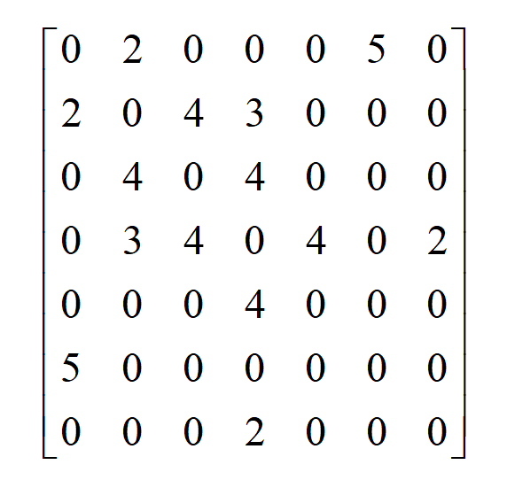

# 拉普拉斯矩阵 (Laplacian Matrix)

拉普拉斯算子在物理学中用来计算一个点的值与邻居平均值的差异。在图神经网络中，它是频域图卷积的基石。

在物理学和数学中，拉普拉斯算符（Laplacian operator，通常记作 $\Delta$ 或 $\nabla^2$）是一个极其核心的二阶微分算子。它不仅是无数物理定律的数学基石，更是描述自然界“空间分布差异”的绝佳工具。

#### 一、 核心物理直觉：与周围环境的“差异度”

在三维直角坐标系中，作用于一个标量场 $f(x,y,z)$（比如空间中的温度分布、电势分布）的拉普拉斯算符定义为它在各个方向上二阶偏导数的总和：

$$ \nabla^2 f = \frac{\partial^2 f}{\partial x^2} + \frac{\partial^2 f}{\partial y^2} + \frac{\partial^2 f}{\partial z^2} $$

**这在物理上到底意味着什么？**
拉普拉斯算符的本质是在计算：**空间中某一点的值，与其无限小邻域内周围点的平均值之间的“差异”。**

*   **当 $\nabla^2 f > 0$（正值）**：这意味着该点的值**低于**周围的平均值。在物理图像上，这里是一个“局部洼地”。自然界的趋势是去填平它。
*   **当 $\nabla^2 f < 0$（负值）**：这意味着该点的值**高于**周围的平均值。这里是一个“局部凸起”或“山峰”。自然界的趋势是让它向外扩散、削平它。
*   **当 $\nabla^2 f = 0$**：这意味着该点的值恰好**等于**周围的平均值。空间在这里完美平滑过渡，没有任何突变。这代表一种没有源头、完美平衡的稳态（如拉普拉斯方程）。

#### 二、 拉普拉斯算符主宰的四大物理定律

自然界中绝大多数的演化过程，本质上都是在“消除差异”或“受差异驱动”。

**1. 热力学与扩散现象：热传导方程 (Heat Equation)**
描述热量如何随时间演化的方程为：

$$ \frac{\partial T}{\partial t} = \alpha \nabla^2 T $$

*   **直白解释**：$T$ 是温度。如果一个点比周围冷（洼地，$\nabla^2 T > 0$），热量就会流向这里，导致温度随时间上升。**拉普拉斯算符在这里扮演了“推动系统走向热平衡”的驱动力。**

**2. 经典力学与声学：波动方程 (Wave Equation)**
描述波（如声波、电磁波）传播的方程为：

$$ \frac{\partial^2 u}{\partial t^2} = c^2 \nabla^2 u $$

*   **直白解释**：$u$ 是介质的位移。如果一根弦在某点被拨起形成峰（$\nabla^2 u < 0$），张力就会试图把它拉回平均位置，赋予它向下加速度。**拉普拉斯算符在这里代表了产生波动的“恢复力”。**

**3. 电磁学与引力：泊松方程 (Poisson's Equation)**
势能分布由泊松方程决定（以静电场为例）：

$$ \nabla^2 \phi = -\frac{\rho}{\varepsilon_0} $$

*   **直白解释**：空间中存在的电荷 $\rho$，会强制扭曲平坦的电势空间，制造“电势山峰”或“洼地”。**拉普拉斯算符在这里度量了由物质或电荷引起的“空间势能场的弯曲程度”。**

**4. 量子力学：薛定谔方程 (Schrödinger Equation)**
微观粒子的定态薛定谔方程包含动能项：

$$ -\frac{\hbar^2}{2m} \nabla^2 \psi + V\psi = E\psi $$

*   **直白解释**：波函数 $\psi$ 在空间中弯曲、震荡得越剧烈（即拉普拉斯算符绝对值越大），意味着粒子的动量越大，动能越高。**拉普拉斯算符在这里直接对应了量子体系的动能。**
核心定义公式：

$$L = D - A$$

*   **$D$ (Degree Matrix, 度矩阵)**：一个对角矩阵。对角线上的数字代表每个节点有几个邻居。
*   **$A$ (Adjacency Matrix, 邻接矩阵)**：记录了节点之间是否相连。如果节点 $i$ 和节点 $j$ 相连，则对应位置的值为 $1$，否则为 $0$。

*   **$L$ (Laplacian Matrix, 拉普拉斯矩阵)**：用 $D$ 减去 $A$ 得到的结果矩阵。

> 参考资料：[知乎专栏 - 图卷积网络 GCN 基础](https://zhuanlan.zhihu.com/p/362416124)